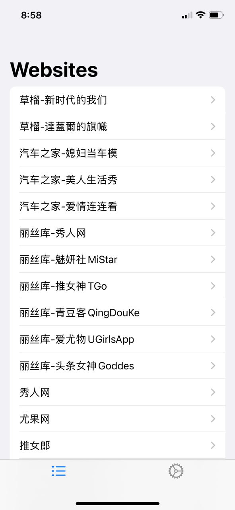
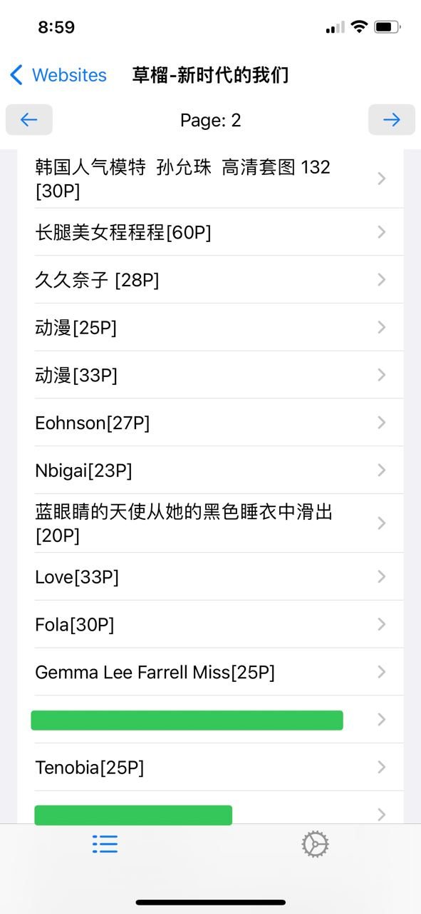
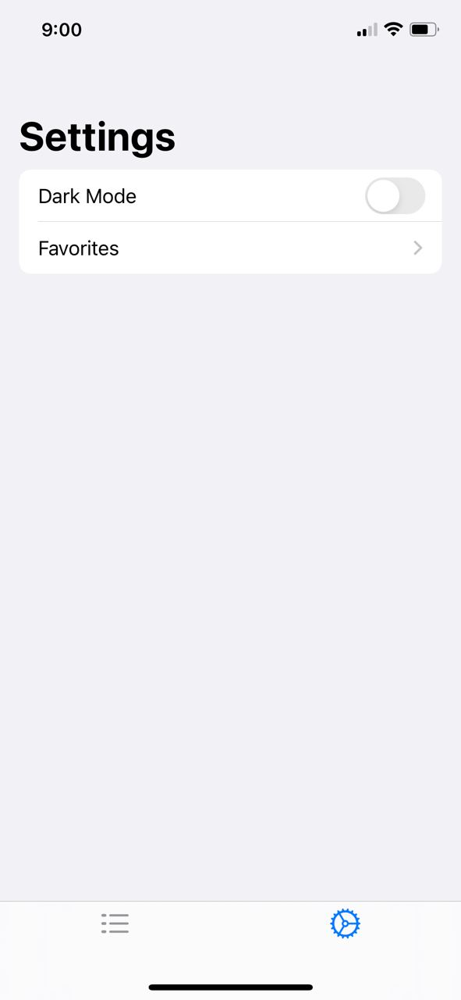
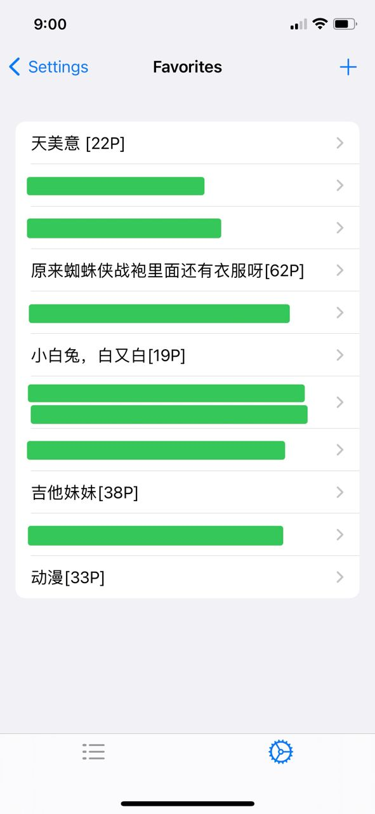

# PicsBrowser

An app which loads images from some websites, making it easy to view those images. If you like those images, then you can add them to you favorites.

This is my first ios app, and almost all code is from the internet. I just did some copy and paste. Although there is no much code, it is very helpful for me to learn swift and swiftui.

If you like it, please feel free to do whatever you want with this app.

## Screenshots

- Website list

  

- Post list

  

- Image gallery

  

- Image viewer

  

- Image viewer scale

  

- Image viewer close

  

- Image viewer swipe

  

- Settings

  

- Favorites

  

- Favorites image gallery

  
